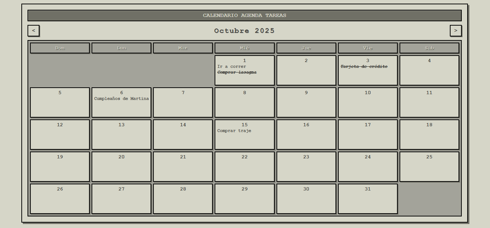

# **Calendario Agenda de Tareas**

### **Descripción del Proyecto**

Este es un proyecto de aplicación web que funciona como un calendario y una agenda de tareas, con una estética visual inspirada en la clásica interfaz de usuario del Macintosh Plus. La aplicación es completamente funcional y se ejecuta en una sola página, permitiendo a los usuarios gestionar sus tareas diarias de manera sencilla y con un toque nostálgico.

Las tareas se guardan de forma persistente en el navegador del usuario utilizando localStorage, lo que elimina la necesidad de una base de datos o conexión a Internet.

### **Características Principales**

* **Diseño Retro:** La interfaz recrea la apariencia monocromática de la década de 1980, con fuentes, bordes y sombras de caja que emulan los gráficos de la época.  
* **Navegación Sencilla:** Permite navegar entre los meses de forma intuitiva utilizando los botones de avance y retroceso.  
* **Gestión de Tareas:** Puedes añadir, editar y eliminar tareas para cualquier día del calendario.  
* **Modales Interactivos:** Utiliza cuadros de diálogo (modales) para una gestión de tareas fluida y organizada.  
* **Persistencia de Datos:** Las tareas se guardan automáticamente en tu navegador, garantizando que no se pierdan al recargar la página.

### **Cómo Usar**

Para ejecutar la aplicación, no necesitas ninguna instalación ni configuración. Simplemente sigue estos pasos:

1. Abre el archivo **index.html** en cualquier navegador web moderno.  
2. Haz clic en cualquier día del calendario para abrir el modal de tareas.  
3. Escribe una nueva tarea en el campo de texto y haz clic en **"Agregar"** o presiona la tecla **Enter**.  
4. Dentro del modal, puedes marcar las tareas como completadas haciendo clic en la casilla de verificación, o editarlas y eliminarlas con los botones correspondientes.

### **Estructura de Archivos**

Este proyecto sigue una estructura simple y organizada:

* **index.html**: Contiene la estructura principal de la interfaz de usuario, incluyendo el calendario y los modales para la gestión de tareas.  
* **styles.css**: Define todos los estilos de la aplicación, dándole la apariencia distintiva de Mac Plus.  
* **app.js**: Contiene la lógica principal de la aplicación. Se encarga de la renderización del calendario, la gestión de eventos de usuario (clics, teclas), y la manipulación de los datos de las tareas en localStorage.
